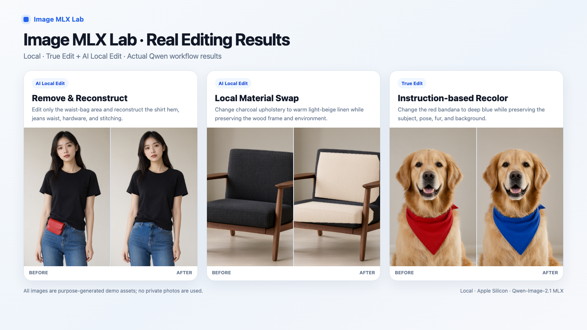

# Image MLX Lab

**English** | [中文](README_ZH.md)


> Project-wide agent/development rules: `docs/PROJECT_GUIDE.md`

Image MLX Lab is a local image generation and AI-assisted editing workbench for Apple Silicon / MLX. The current backend is Qwen-Image-2.1, while the project name intentionally stays model-agnostic so other MLX image models can be added later.

All generation and editing run locally. Images, prompts, and results are not sent to a remote service by Image MLX Lab. The web UI listens on `127.0.0.1` only, so it is not exposed to other devices on the LAN by default.

Primary test machine: Apple M2 Max with 32 GB unified memory.

## Demos and documentation

[English User Guide](docs/USER_GUIDE_EN.md) · [中文使用说明](docs/USER_GUIDE_ZH.md)



The examples above use purpose-generated demo assets and were produced through the actual Qwen workflow.

- **AI Local Edit**: edit only the Mask region; pixels outside the Mask are protected by the final full-size compositing step.
- **Remove and reconstruct**: remove an obstruction and reconstruct hidden structure.
- **Local material swap**: change material and color only inside the selected area.
- **True Edit**: make explicit object or attribute changes with natural-language instructions.
- Text to Image, Image to Image, selections, healing, clone stamp, copy/paste, color adjustments, crop, resize, rotate, and more.

## Responsible use

Follow applicable law and respect privacy, likeness rights, and other legitimate rights.

Do not use this tool to create sexual content involving minors, non-consensual intimate or sexual imagery, fraudulent impersonation, harassment, extortion, or other unlawful content. You are responsible for ensuring that your use and generated / edited content comply with applicable law, platform rules, and model licenses.

## Licenses

Code and model weights have different licenses:

- **Image MLX Lab source code** is released under the [MIT License](LICENSE), © 2026 Houjun Co., Ltd.
- The default **Qwen-Image-2.1 model** is governed by the [Qwen Research License](https://github.com/QwenLM/Qwen-Image-2.1/blob/main/LICENSE). It is limited to non-commercial research / evaluation unless you obtain separate commercial permission from the model provider. Model weights are not included in this repository.
- The runtime [ddalcu/mlx-serve](https://github.com/ddalcu/mlx-serve) uses MIT / Apache-2.0. This repository ships only a patch that is applied during setup.
- You are responsible for how generated and edited content is used and for compliance with the model license.

See [NOTICE](NOTICE) for details.

## Requirements

- Apple Silicon Mac (M1 or later). 32 GB+ unified memory is recommended.
- The 4-bit model needs roughly 14 GB of free memory while loading. Lower-memory Macs may require **Skip memory preflight**, which can use substantial swap and become much slower.
- Disk usage: about 10 GB for 4-bit, 17.6–18 GB for 8-bit, about 1.1 GB per optional edit-vision module, plus roughly 2 GB for the runtime toolchain.
- **The first model download requires at least 24 GiB of free disk space.** The setup script enforces this to avoid failing mid-download.
- Xcode 26.2+ with the Metal Toolchain component.
- Homebrew `cmake`.
- Python 3.9+.

If `xcrun -sdk macosx metal --version` fails, install the Metal Toolchain with:

```bash
xcodebuild -downloadComponent MetalToolchain
```

## First-time setup

```bash
cd ~/Documents
git clone https://github.com/hera2019/image-mlx-lab.git
cd image-mlx-lab
python3 -m venv .venv
.venv/bin/pip install -r requirements.txt
```

Download the 4-bit model and build the pinned runtime:

```bash
.venv/bin/python scripts/setup_model.py --model qwen-image-2.1-mlx-4bit
```

For 8-bit, replace the model name with `qwen-image-2.1-mlx-8bit`. Both variants can be installed and switched from the UI later.

The setup script will:

1. Download the quantized model to `~/Documents/AI-Models/image/<model-name>/`.
2. Ask whether to download the optional edit-vision module (~1.1 GB).
3. Fetch a pinned `mlx-serve` revision, apply the project patch, and build it under `worktrees/mlx-serve/`.

The edit-vision module is optional:

| Feature | Edit vision required? |
| --- | --- |
| Text to Image, Image to Image, normal image editing | No |
| True Edit, AI Local Edit | Yes |

Use `--edit-vision` or `--skip-edit-vision` to avoid the interactive prompt.

To add edit vision later:

```bash
.venv/bin/python scripts/fetch_edit_vision.py --model-dir ~/Documents/AI-Models/image/qwen-image-2.1-mlx-4bit
```

## Start and stop

Double-click `Start-Image-MLX-Lab.command`.

The browser opens:

`http://127.0.0.1:18080/web/mask-editor/`

The local model loads in the background. The top-right status shows loading / ready state and lets you switch model variants.

To stop the workbench, double-click `Stop-Image-MLX-Lab.command`.

The UI supports **中文 / English** from the top-right language selector. The selected language is stored locally in the browser.

## 4-bit and 8-bit

Click the model status badge in the top-right corner.

| Variant | Model size | Recommended for |
| --- | ---: | --- |
| 4-bit | ~10 GB | Lower memory use; recommended for Macs with 32 GB or less |
| 8-bit | ~17.6 GB | Lower quantization loss; recommended for 48 GB+ memory |

- The recommended variant is chosen from installed models and total memory.
- Your manual choice is saved in `results/settings.json`.
- Switching unloads the current model and reloads the selected one, usually taking 1–3 minutes.
- Model switching is blocked while generation / AI editing is running.
- **Skip memory preflight** can force loading when free memory is low. It may cause heavy swap use and severe slowdown.
- The project does not use the full BF16 weights by default because their main components are too large for a comfortable 32 GB workflow.

## Main features

The four top modes change the left tool panel; the center image and right-side library stay available.

- **Text to Image** — local generation, with optional transparent RGBA output.
- **Image to Image / Variation** — create related versions from a source image; best for broader style, composition, or overall changes.
- **True Edit** — explicit instruction-based editing, with up to 3 extra reference images.
- **Image Editor** — rectangle / ellipse / free lasso / brush / magic-wand selections; expand / contract / feather; clone stamp; healing brush; copy / cut / paste across images; rotate / resize / crop; brightness / contrast / saturation / blur / sharpen.
- **AI Local Edit** — edit only a selected Mask area. The final result is recomposited with the frozen full-size Mask so pixels outside the Mask remain unchanged.

Image editing is non-destructive by default: **Save as New** is the normal workflow. Switching images or leaving the page prompts before unsaved changes are discarded.

Only one generation / AI edit job runs at a time, including across multiple browser tabs.

### English UI and model prompts

The UI can be displayed in English, but several model-internal prompts intentionally remain in Chinese because they are part of the tested Qwen editing workflow. This includes the AI Local Edit wrapper, reference-role prefixes, and transparent-background instruction. UI translation is kept separate from model prompt text.

## Pinned versions

- 4-bit: `ddalcu/Qwen-Image-2.1-MLX-Serve-4bit` @ `88eb1b3bb5591ed59b68a6e1a1c2d9baade73e38`
- 8-bit: `ddalcu/Qwen-Image-2.1-MLX-Serve-8bit` @ `fbda4caa0b4b1e17b5a29633e8deb600386f1eaf`
- Edit vision source: `Qwen/Qwen-Image-2.1` @ `790c92633540aa0cb11d9abf19eb46d861714758`
- Runtime: `ddalcu/mlx-serve`, branch `feat/qwen-image-2.1`, commit `c7c2cc5b3d160ecac2ad16b00d4feedfc6ce5e93`

The runtime branch is still a Qwen-Image-2.1 feature branch, so the commit is pinned for reproducibility.

## CLI scripts (optional)

You can use the model service without the web UI.

Start the model:

```bash
./scripts/start_server.sh 4bit
# or: ./scripts/start_server.sh 8bit
# add "force" as the second argument to skip memory preflight
```

Quick smoke test:

```bash
.venv/bin/python scripts/generate.py \
  --prompt "A red fox standing in fresh snow, realistic morning light" \
  --size 512x512 --steps 4 --seed 42
```

For a higher-quality run, increase size / steps, for example `1024x1024` and `--steps 40`. `--prompt-file prompt.txt` reads a UTF-8 prompt file.

Outputs go to `results/generated/`.

## Local data

The entire `results/` directory is ignored by Git and stays local:

- `results/web/` — final web-generated / edited images
- `results/library/` — loaded images
- `results/intermediate/` — raw intermediate model outputs
- `results/performance/` — timing, memory, swap, and prompt records
- `results/settings.json` — saved model choice

Model logs are stored at `~/.mlx-serve/logs/image-mlx-lab-model.log`.

## Current test boundary

The quantized packages are primarily validated for practical use on Apple Silicon. Qwen-Image-2.1 also supports capabilities in its official BF16 path; results from the quantized MLX workflow should not be treated as a substitute for conclusions about the official BF16 implementation.
