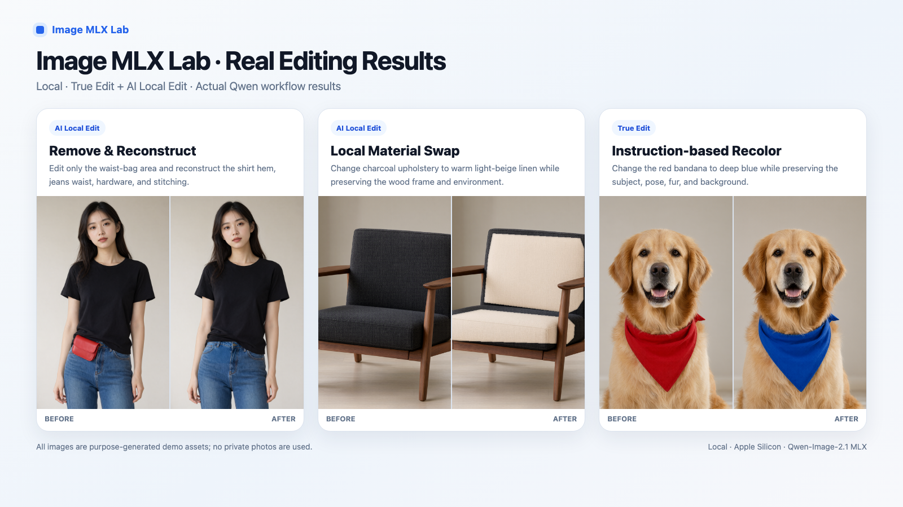

# Image MLX Lab

**Local AI image generator and editor for Mac.** Generate images from a prompt and edit the
ones you have — remove an object, swap a material, change a colour with a sentence — with
mask-based AI inpainting that keeps every pixel outside your selection unchanged. Runs
entirely on Apple Silicon with Qwen-Image on MLX. Free, open-source code.

**Website: <https://houjun.dev/iml/>** · *[中文说明](README_ZH.md)* ·
[User guide](docs/USER_GUIDE_EN.md)


A local image generation and AI-assisted editing workbench for Apple Silicon Macs: text to
image, image variations, instruction-based editing (True Edit) and AI local edit on a
selected mask, next to ordinary editing tools — selections, healing, clone stamp, copy and
paste, crop, colour. The backend today is Qwen-Image-2.1 on MLX; the project name stays
model-agnostic so other MLX image models can be added later.

> **Image MLX Lab 1.0.** The whole workflow — text to image, variations, True Edit,
> AI local edit, the editing tools, 4-bit / 8-bit model management and the Chinese /
> English interface — is complete and runs end to end. Installation has so far been
> verified on the development Mac only (M2 Max, 32 GB); if the setup fails on yours,
> please [open an issue](https://github.com/hera2019/image-mlx-lab/issues). It is a
> developer install, it is not fast, and the default model is for non-commercial use —
> see [Limits](#limits) and [Licenses](#licenses).



*Actual output of the local workflow on purpose-generated demo images — no private photos,
nothing retouched afterwards.*

---

## What you can do with it

Personal projects, experiments and learning — with pictures you would rather not send to a
cloud service.

- **Remove things from your photos** — take out a bag, a cable, a sign or a passer-by and let
  the model rebuild what was behind it, inside the area you selected.
- **Try a colour or material first** — a sofa in linen instead of wool, a jacket in navy
  instead of red, a wall in another colour, before you buy, sew or paint.
- **Change a detail with words** — “make the scarf deep blue”: True Edit follows an
  instruction on the whole image, with up to three reference pictures for identity, pose,
  clothes or style.
- **Make new images** — from a prompt in English or Chinese, including transparent PNGs for
  your own icons, stickers and mock-ups, or variations of an image you have.
- **Classic touch-ups in the same place** — healing brush, clone stamp, copy and paste between
  images, crop, resize, rotate, brightness, contrast and sharpness.
- **Learn how local image models behave** — compare 4-bit and 8-bit, steps and sizes on your
  own Mac; every run records its time, memory and swap.

The default model, Qwen-Image-2.1, is licensed for non-commercial research and evaluation.
For commercial work you need a licence from Qwen — see [Licenses](#licenses).

## Your pictures stay on your computer

Image MLX Lab is built for pictures you would not hand to an online service: photos of your
family, your home, your unreleased work.

- **From first image to finished file**, the images you load, your selections, prompts and
  every result are stored in the `results/` folder of your copy. Nothing is uploaded at any
  step.
- **Local AI, not a cloud API.** Qwen-Image runs on your Mac's own chip through Apple's MLX.
  After setup, generating and editing need no internet connection.
- **No account, no telemetry.** Nothing to sign up for, nothing reported back: no usage data,
  no analytics, no crash reports.
- **Closed to other devices and websites.** The workbench and the model server listen on this
  Mac only (`127.0.0.1`); the workbench refuses requests from other web pages, so a site you
  visit cannot read or change your images.

## Responsible use

Obey the laws where you are and respect other people's privacy, likeness and rights in their
pictures. Do not use Image MLX Lab to make sexual content involving minors, intimate or sexual
images of anyone without their consent, fake images meant to deceive or to impersonate someone,
harassment, extortion, or anything else unlawful. Edit photos of real people only in ways they
would agree to, and say so when you publish an image you made or substantially changed with AI —
the app adds no watermark. You are responsible for how you use the software and the model, and
for everything you generate or edit. Full rules: <https://houjun.dev/iml/responsible-use.html>.

## Licenses

Code and model weights have different licenses:

| Part | License | Commercial use |
| --- | --- | --- |
| Image MLX Lab source code | [MIT License](LICENSE), © 2026 Houjun Co., Ltd. | Allowed |
| Qwen-Image-2.1 model (default, downloaded separately) | [Qwen Research License](https://github.com/QwenLM/Qwen-Image-2.1/blob/main/LICENSE) | Not without a licence from Qwen |
| [ddalcu/mlx-serve](https://github.com/ddalcu/mlx-serve) runtime (built during setup) | MIT / Apache-2.0 | Allowed, under its terms |

- Model weights are not included in this repository. This repository ships only a patch for
  mlx-serve, applied during setup.
- In practice, using Image MLX Lab with its default model is non-commercial unless you obtain
  a commercial licence from Qwen.
- You are responsible for how generated and edited content is used and for compliance with the
  model license.

See [NOTICE](NOTICE) and <https://houjun.dev/iml/license.html>.

## Requirements

- Apple Silicon Mac (M1 or later). 32 GB+ unified memory is recommended.
- The 4-bit model needs roughly 14 GB of free memory while loading. Lower-memory Macs may require **Skip memory preflight**, which can use substantial swap and become much slower.
- Disk usage: about 10 GB for 4-bit, 17.6–18 GB for 8-bit, about 1.1 GB per optional edit-vision module, plus roughly 2 GB for the runtime toolchain.
- **The first model download requires at least 24 GiB of free disk space.** The setup script enforces this to avoid failing mid-download.
- Xcode 26.2+ with the Metal Toolchain component.
- Homebrew `cmake`.
- Python 3.9+.

If `xcrun -sdk macosx metal --version` fails, install the Metal Toolchain with:

```bash
xcodebuild -downloadComponent MetalToolchain
```

## First-time setup

```bash
cd ~/Documents
git clone https://github.com/hera2019/image-mlx-lab.git
cd image-mlx-lab
python3 -m venv .venv
.venv/bin/pip install -r requirements.txt
```

Download the 4-bit model and build the pinned runtime:

```bash
.venv/bin/python scripts/setup_model.py --model qwen-image-2.1-mlx-4bit
```

For 8-bit, replace the model name with `qwen-image-2.1-mlx-8bit`. Both variants can be installed and switched from the UI later.

The setup script will:

1. Download the quantized model to `~/Documents/AI-Models/image/<model-name>/`.
2. Ask whether to download the optional edit-vision module (~1.1 GB).
3. Fetch a pinned `mlx-serve` revision, apply the project patch, and build it under `worktrees/mlx-serve/`.

The edit-vision module is optional:

| Feature | Edit vision required? |
| --- | --- |
| Text to Image, Image to Image, normal image editing | No |
| True Edit, AI Local Edit | Yes |

Use `--edit-vision` or `--skip-edit-vision` to avoid the interactive prompt.

To add edit vision later:

```bash
.venv/bin/python scripts/fetch_edit_vision.py --model-dir ~/Documents/AI-Models/image/qwen-image-2.1-mlx-4bit
```

## Start and stop

Double-click `Start-Image-MLX-Lab.command`.

The browser opens:

`http://127.0.0.1:18080/web/mask-editor/`

The local model loads in the background. The top-right status shows loading / ready state and lets you switch model variants.

To stop the workbench, double-click `Stop-Image-MLX-Lab.command`.

The UI supports **中文 / English** from the top-right language selector. The selected language is stored locally in the browser.

## 4-bit and 8-bit

Click the model status badge in the top-right corner.

| Variant | Model size | Recommended for |
| --- | ---: | --- |
| 4-bit | ~10 GB | Lower memory use; recommended for Macs with 32 GB or less |
| 8-bit | ~17.6 GB | Lower quantization loss; recommended for 48 GB+ memory |

- The recommended variant is chosen from installed models and total memory.
- Your manual choice is saved in `results/settings.json`.
- Switching unloads the current model and reloads the selected one, usually taking 1–3 minutes.
- Model switching is blocked while generation / AI editing is running.
- **Skip memory preflight** can force loading when free memory is low. It may cause heavy swap use and severe slowdown.
- The project does not use the full BF16 weights by default because their main components are too large for a comfortable 32 GB workflow.

## Main features

The four top modes change the left tool panel; the center image and right-side library stay available.

- **Text to Image** — local generation, with optional transparent RGBA output.
- **Image to Image / Variation** — create related versions from a source image; best for broader style, composition, or overall changes.
- **True Edit** — explicit instruction-based editing, with up to 3 extra reference images.
- **Image Editor** — rectangle / ellipse / free lasso / brush / magic-wand selections; expand / contract / feather; clone stamp; healing brush; copy / cut / paste across images; rotate / resize / crop; brightness / contrast / saturation / blur / sharpen.
- **AI Local Edit** — edit only a selected Mask area. The final result is recomposited with the frozen full-size Mask so pixels outside the Mask remain unchanged.

Image editing is non-destructive by default: **Save as New** is the normal workflow. Switching images or leaving the page prompts before unsaved changes are discarded.

Only one generation / AI edit job runs at a time, including across multiple browser tabs.

### English UI and model prompts

The UI can be displayed in English, but several model-internal prompts intentionally remain in Chinese because they are part of the tested Qwen editing workflow. This includes the AI Local Edit wrapper, reference-role prefixes, and transparent-background instruction. UI translation is kept separate from model prompt text.

## Pinned versions

- 4-bit: `ddalcu/Qwen-Image-2.1-MLX-Serve-4bit` @ `88eb1b3bb5591ed59b68a6e1a1c2d9baade73e38`
- 8-bit: `ddalcu/Qwen-Image-2.1-MLX-Serve-8bit` @ `fbda4caa0b4b1e17b5a29633e8deb600386f1eaf`
- Edit vision source: `Qwen/Qwen-Image-2.1` @ `790c92633540aa0cb11d9abf19eb46d861714758`
- Runtime: `ddalcu/mlx-serve`, branch `feat/qwen-image-2.1`, commit `c7c2cc5b3d160ecac2ad16b00d4feedfc6ce5e93`

The runtime branch is still a Qwen-Image-2.1 feature branch, so the commit is pinned for reproducibility.

## CLI scripts (optional)

You can use the model service without the web UI.

Start the model:

```bash
./scripts/start_server.sh 4bit
# or: ./scripts/start_server.sh 8bit
# add "force" as the second argument to skip memory preflight
```

Quick smoke test:

```bash
.venv/bin/python scripts/generate.py \
  --prompt "A red fox standing in fresh snow, realistic morning light" \
  --size 512x512 --steps 4 --seed 42
```

For a higher-quality run, increase size / steps, for example `1024x1024` and `--steps 40`. `--prompt-file prompt.txt` reads a UTF-8 prompt file.

Outputs go to `results/generated/`.

## Local data

The entire `results/` directory is ignored by Git and stays local:

- `results/web/` — final web-generated / edited images
- `results/library/` — loaded images
- `results/intermediate/` — raw intermediate model outputs
- `results/performance/` — timing, memory, swap, and prompt records
- `results/settings.json` — saved model choice

Model logs are stored at `~/.mlx-serve/logs/image-mlx-lab-model.log`.

## Limits

- **It is not fast.** On an M2 Max with 32 GB (8-bit model) a 512×512 image at 20 steps took
  about 1–1.5 minutes, an AI local edit at 480×640 and 20 steps about 5 minutes, and a True
  Edit at 1152×640 and 36 steps 11–17 minutes.
- **Apple Silicon only**, 32 GB recommended; see [Requirements](#requirements).
- **A developer install**: Xcode with the Metal toolchain, a terminal and 12–20 GB of
  downloads. There is no signed installer.
- **Edits are not always clean.** A mask that stops short leaves the old surface at its edge,
  and some removals show a seam; check every result.
- **Quantized, not official.** The quantized MLX packages are primarily validated for practical
  use on Apple Silicon. Results from this workflow are not a substitute for conclusions about
  the official full-precision (BF16) Qwen-Image-2.1.

## For contributors

Project-wide development and safety rules for humans and coding agents:
[`docs/PROJECT_GUIDE.md`](docs/PROJECT_GUIDE.md). Before publishing anything, run
`python3 scripts/check_public_release.py` and read [`PUBLIC_RELEASE.md`](PUBLIC_RELEASE.md).
The website lives in [`site/`](site/README.md). Security reports: support@houjun.dev
(see <https://houjun.dev/iml/security.html>), not a public issue.
