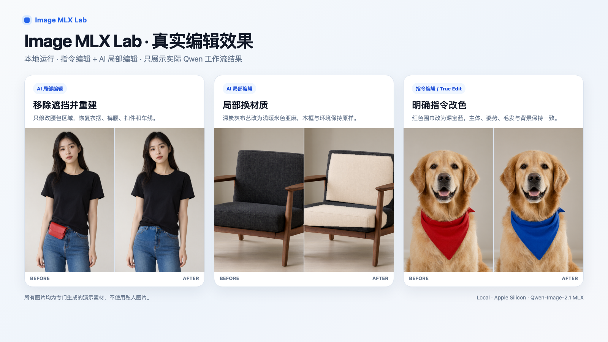

# Image MLX Lab

[English](README.md) | **中文**


> Project-wide agent/development rules: `docs/PROJECT_GUIDE.md`

Image MLX Lab 是一个面向 Apple Silicon / MLX 的本地图像生成与编辑研究工作台。当前后端是 Qwen-Image-2.1；项目命名不绑定具体模型，后续可以继续接入其他 MLX 图像模型。

所有计算都在本机完成：图片、提示词和结果不会上传到任何服务器；网页界面只监听 `127.0.0.1`，局域网里的其他设备无法访问。

当前主要测试机器：Apple M2 Max，32 GB 统一内存。

## 效果与使用说明

[English User Guide](docs/USER_GUIDE_EN.md) · 中文完整使用说明：[docs/USER_GUIDE_ZH.md](docs/USER_GUIDE_ZH.md)



上图全部使用专门生成的演示素材，并通过实际 Qwen 工作流完成。当前重点能力包括：

- **AI 局部编辑**：只修改 Mask 内区域，Mask 外像素保持原图不变；
- **遮挡移除与结构重建**：例如去掉腰包后恢复被遮挡的衣摆、裤腰和细节；
- **局部材质替换**：只替换指定区域的材质与颜色；
- **指令编辑（True Edit）**：用自然语言完成明确的对象 / 属性修改；
- 文生图、图生图、选区、修复、克隆、复制粘贴、调色、裁剪等普通工作台能力。

公开截图和演示图只使用专门生成并人工检查过的素材，不直接使用 `results/` 中的私人图片或测试结果。

## 使用规范

请遵守当地法律，并尊重他人的隐私、肖像权和其他合法权益。

不得将本工具用于制作涉及未成年人的色情内容、未经本人同意的私密或色情影像、欺诈性冒充、骚扰、勒索或其他违法用途。使用者应自行确认其使用方式及生成 / 编辑内容符合适用法律、平台规则和模型许可证。

## 许可证

代码和模型适用不同的许可证：

- **Image MLX Lab 源代码**采用 [MIT License](LICENSE)，© 2026 Houjun Co., Ltd.。
- **默认使用的 Qwen-Image-2.1 模型**受 [Qwen Research License](https://github.com/QwenLM/Qwen-Image-2.1/blob/main/LICENSE) 限制，**仅限非商业的研究和评估用途**；商业使用该模型需要另行取得 Qwen 的许可。模型权重不包含在本仓库中，需要自行下载。
- 运行时 [ddalcu/mlx-serve](https://github.com/ddalcu/mlx-serve) 采用 MIT / Apache-2.0，本仓库只附带一个补丁，安装时自动应用。
- 用模型生成、编辑出来的内容由使用者自行负责，并受模型许可证约束。

详见 [NOTICE](NOTICE)。

## 需要准备

- Apple Silicon Mac（M1 及以后），建议 32 GB 及以上统一内存。4-bit 加载时约需 14 GB 空闲内存；内存更小的机器需要“跳过内存预检”，会大量使用 swap、明显变慢。
- 磁盘空间：4-bit 约 10 GB，8-bit 约 18 GB；可选的编辑用视觉模块每个版本再加约 1.1 GB；另需约 2 GB 编译运行时。**首次下载模型前安装脚本会要求至少 24 GiB 可用空间**，用于避免下载到一半因空间不足失败。
- Xcode 26.2+，并安装 Metal Toolchain 组件（`xcrun -sdk macosx metal --version` 报错时运行 `xcodebuild -downloadComponent MetalToolchain`）。
- Homebrew 的 `cmake`：`brew install cmake`。
- Python 3.9+（macOS 自带的 `python3` 即可）。

## 第一次安装

```bash
cd ~/Documents
git clone https://github.com/hera2019/image-mlx-lab.git
cd image-mlx-lab
python3 -m venv .venv
.venv/bin/pip install -r requirements.txt
```

下载模型并编译运行时（首次需要较长时间，下载支持断点续传）：

```bash
.venv/bin/python scripts/setup_model.py --model qwen-image-2.1-mlx-4bit
```

想用 8-bit 就把参数换成 `qwen-image-2.1-mlx-8bit`；两个版本可以都装，之后在界面里切换。

这一步会：
1. 下载量化模型到 `~/Documents/AI-Models/image/<模型名>/`；
2. **询问**是否下载编辑用视觉模块（约 1.1 GB，只从官方权重中截取视觉部分）；
3. 拉取固定版本的 `mlx-serve`、应用补丁并编译到 `worktrees/mlx-serve/`。

编辑用视觉模块是可选的，按需安装：

| 功能 | 需要视觉模块吗 |
|---|---|
| 文生图、图生图、普通图片编辑（选区、修复、调色、裁剪等） | 不需要 |
| 指令编辑（True Edit）、AI 局部编辑 | 需要 |

不想被询问时，可以直接加 `--edit-vision`（下载）或 `--skip-edit-vision`（不下载）。
没装时，这两个功能会给出明确提示，模型设置里也会显示补装命令。以后需要时随时补装：

```bash
.venv/bin/python scripts/fetch_edit_vision.py --model-dir ~/Documents/AI-Models/image/qwen-image-2.1-mlx-4bit
```

## 启动与停止

双击 `Start-Image-MLX-Lab.command`，浏览器会打开 `http://127.0.0.1:18080/web/mask-editor/`。
模型在后台加载，页面右上角会显示状态，并可使用 `中文 / English` 切换界面语言。

停止：双击 `Stop-Image-MLX-Lab.command`。

## 选择 4-bit / 8-bit

点击页面右上角的模型状态（例如“Qwen 4-bit · 在线”）打开模型设置：

| 版本 | 模型大小 | 适合 |
|---|---|---|
| 4-bit | 约 10 GB | 占用内存少；推荐 32 GB 及以下内存的 Mac |
| 8-bit | 约 17.6 GB | 量化损失更小；推荐 48 GB 以上内存 |

- 默认按本机内存和已安装的版本自动推荐；手动选择后会保存在 `results/settings.json`，下次启动沿用。
- 切换会卸载当前模型并重新加载，通常需要 1–3 分钟；有生成任务运行时不能切换。
- **跳过内存预检（高级）**：mlx-serve 会在空闲内存不足时拒绝加载模型。勾选后强制加载，32 GB 机器跑 8-bit 通常需要它，但可能大量使用 swap、明显变慢。
- 不使用官方 BF16 全量权重：主要组件约 33 GB，对 32 GB Mac 余量太小。

## 功能

顶部四个模式只切换左侧工具栏；中间主图和右侧图片库始终保留。

- **文生图**：可选透明 RGBA 背景。
- **图生图**：根据原图生成相似变体，适合整体风格、构图变化。
- **指令编辑（True Edit）**：按文字修改指定内容，可附加最多 3 张参考图。
- **图片编辑**：矩形 / 椭圆 / 套索 / 画笔 / 魔棒选区，扩展 / 收缩 / 羽化；克隆图章、修复画笔；复制 / 剪切 / 粘贴（可跨图片）；旋转、缩放、裁剪；亮度 / 对比度 / 饱和度 / 模糊 / 锐化；以及 **AI 局部编辑**。
- **AI 局部编辑**：只修改选区（Mask）内的像素，选区外保证不变；结果自动另存为新图，原图保留。

编辑默认不覆盖原图：“保存为新图”是默认选项；切换图片、关闭页面时，未保存的修改都会先提示。
同一时间只运行一个生成 / AI 编辑任务。

## 固定版本

- 4-bit：`ddalcu/Qwen-Image-2.1-MLX-Serve-4bit` @ `88eb1b3bb5591ed59b68a6e1a1c2d9baade73e38`
- 8-bit：`ddalcu/Qwen-Image-2.1-MLX-Serve-8bit` @ `fbda4caa0b4b1e17b5a29633e8deb600386f1eaf`
- 编辑视觉模块来源：`Qwen/Qwen-Image-2.1` @ `790c92633540aa0cb11d9abf19eb46d861714758`
- runtime：`ddalcu/mlx-serve`，branch `feat/qwen-image-2.1`，commit `c7c2cc5b3d160ecac2ad16b00d4feedfc6ce5e93`

runtime 目前仍是未正式发布的 Qwen-Image-2.1 feature branch，所以同时固定 commit，避免分支变化影响复现。

## 命令行脚本（可选）

不开网页也可以直接调用模型服务。先单独启动模型：

```bash
./scripts/start_server.sh 4bit          # 或 8bit；加第二个参数 force 可跳过内存预检
```

快速冒烟测试：

```bash
.venv/bin/python scripts/generate.py \
  --prompt "一只红狐狸站在新雪中，清晨自然光，写实摄影" \
  --size 512x512 --steps 4 --seed 42
```

正式质量测试可改成 `1024x1024`、`--steps 40`；也可以用 `--prompt-file prompt.txt` 读取 UTF-8 提示词文件。
输出在 `results/generated/`，文件名是“提示词前缀 + 时间”，连续生成不会互相覆盖。

## 本地数据

整个 `results/` 目录都被 Git 忽略，只保存在本机：

- `results/web/`：网页生成 / 编辑后的正式图片；
- `results/library/`：载入的图片；
- `results/intermediate/`：模型原始中间输出（右侧图片库默认不显示，可筛选“中间结果”查看）；
- `results/performance/`：生成耗时、内存和 swap 记录；
- `results/settings.json`：界面里选择的模型版本。

模型日志在 `~/.mlx-serve/logs/image-mlx-lab-model.log`。

## 当前测试边界

量化包主要用于 Apple Silicon 上的可用性验证。Qwen-Image-2.1 官方模型还支持原生透明图和多参考图编辑，
但这些能力不应直接用量化包的结果代替官方 BF16 路径的结论。
