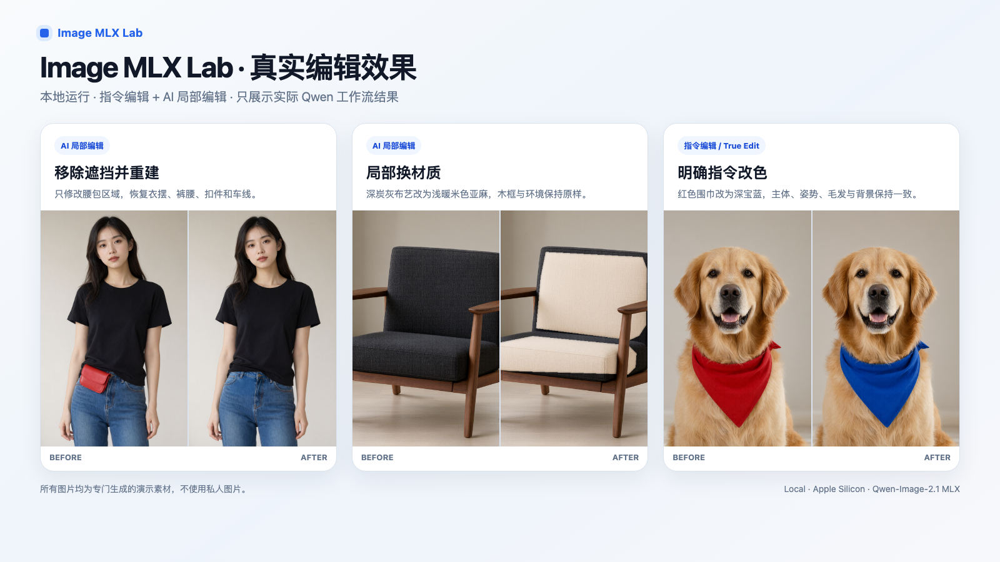

# Image MLX Lab

**Mac 本地 AI 绘图与修图工具。** 用提示词生成图片，也能修改已有图片：去掉物体、替换材质、一句话改颜色。
AI 局部编辑只改你选中的区域，选区外的每个像素都保持原样。全部在 Apple Silicon 上用 Qwen-Image + MLX
本地运行。代码免费开源。

**官网：<https://houjun.dev/iml/>** · *[English](README.md)* ·
[中文使用说明](docs/USER_GUIDE_ZH.md)


面向 Apple Silicon Mac 的本地图像生成与 AI 编辑工作台：文生图、图生图、指令编辑（True Edit）、
按选区（Mask）做 AI 局部编辑，外加常用修图工具——选区、修复画笔、克隆图章、复制粘贴、裁剪、调色。
当前后端是 MLX 上的 Qwen-Image-2.1；项目名不绑定具体模型，以后可以接入其他 MLX 图像模型。

> **Image MLX Lab 1.0。** 完整流程——文生图、图生图、指令编辑、AI 局部编辑、修图工具、4-bit / 8-bit
> 模型管理和中英文界面——都已完成，可以从头跑到尾。目前安装只在开发用的 Mac（M2 Max，32 GB）上验证过；
> 如果在你的 Mac 上安装失败，请[提交 issue](https://github.com/hera2019/image-mlx-lab/issues)。
> 需要开发者方式安装，速度不快，默认模型仅限非商业用途——见[限制](#限制)和[许可证](#许可证)。



*本地工作流的真实输出，素材是专门生成的演示图——没有私人照片，事后没有修饰。*

---

## 可以用它做什么

个人项目、实验和学习——处理那些你不想交给云服务的图片。

- **去掉照片里多余的东西**——拿掉包、电线、招牌或路人，让模型在你选中的范围里补出后面原本的样子。
- **先试颜色和材质**——沙发换成亚麻、外套换成藏青、墙换个颜色，买之前、做之前先看看效果。
- **一句话改细节**——“把围巾改成深蓝色”：指令编辑按文字修改整张图，还能附加最多 3 张参考图，
  指定身份、姿态、服装或风格。
- **生成新图片**——用中文或英文提示词生成，也可以生成透明背景 PNG，做自己的图标、贴纸和样稿；
  或者根据已有图片生成变体。
- **常用修图在同一处完成**——修复画笔、克隆图章、跨图片复制粘贴、裁剪、缩放、旋转、亮度、对比度、锐化。
- **了解本地图像模型的表现**——在自己的 Mac 上比较 4-bit 和 8-bit、步数和尺寸；每次运行都会记录耗时、
  内存和 swap。

默认模型 Qwen-Image-2.1 的许可证只允许非商业的研究和评估。商业用途需要取得 Qwen 的许可——见[许可证](#许可证)。

## 图片始终留在你的电脑上

Image MLX Lab 就是为那些不想交给在线服务的图片做的：家人的照片、自己的家、还没发布的作品。

- **从第一张图到最终文件**，载入的图片、选区、提示词和所有结果，都保存在你这份程序的 `results/` 文件夹里。
  任何一步都不会上传。
- **本地 AI，不是云端 API。** Qwen-Image 通过 Apple 的 MLX 在 Mac 自己的芯片上运行。安装完成后，
  生成和编辑都不需要联网。
- **没有账号，没有遥测。** 不用注册，也不回传任何东西：没有使用数据、没有统计分析、没有崩溃报告。
- **其他设备和网站都访问不到。** 工作台和模型服务只监听本机（`127.0.0.1`）；工作台会拒绝来自其他网页的请求，
  你浏览的网站无法读取或修改你的图片。

## 使用规范

请遵守当地法律，尊重他人的隐私、肖像权和对其图片的权利。不得用 Image MLX Lab 制作涉及未成年人的色情内容、
未经本人同意的私密或色情图片、用于欺骗或冒充他人的假图片，也不得用于骚扰、勒索或其他违法用途。
编辑真人照片时，只做对方会同意的修改；公开发布用 AI 生成或大幅修改的图片时请注明——本软件不会添加水印。
你要对自己如何使用本软件和模型、以及生成或编辑的全部内容负责。完整规范：<https://houjun.dev/iml/responsible-use.html>。

## 许可证

代码和模型适用不同的许可证：

| 部分 | 许可证 | 商业使用 |
| --- | --- | --- |
| Image MLX Lab 源代码 | [MIT License](LICENSE)，© 2026 Houjun Co., Ltd. | 允许 |
| Qwen-Image-2.1 模型（默认，需另行下载） | [Qwen Research License](https://github.com/QwenLM/Qwen-Image-2.1/blob/main/LICENSE) | 未取得 Qwen 许可时不允许 |
| 运行时 [ddalcu/mlx-serve](https://github.com/ddalcu/mlx-serve)（安装时编译） | MIT / Apache-2.0 | 按其条款允许 |

- 模型权重不包含在本仓库中。本仓库只附带一个 mlx-serve 补丁，安装时自动应用。
- 实际上，用默认模型使用 Image MLX Lab 属于非商业用途，除非你另行取得 Qwen 的商业许可。
- 生成和编辑内容的使用方式、以及是否符合模型许可证，由使用者自行负责。

详见 [NOTICE](NOTICE) 和 <https://houjun.dev/iml/license.html>。

## 定制开发

Houjun Co., Ltd. 也承接本地 AI 系统的开发与集成：让图像、语音和语言模型在你自己的硬件上运行。想把 Image MLX Lab 改造进你的产品或工作流程，或做类似的本地 AI 项目，请联系 support@houjun.dev。

## 需要准备

- Apple Silicon Mac（M1 及以后），建议 32 GB 及以上统一内存。4-bit 加载时约需 14 GB 空闲内存；内存更小的机器需要“跳过内存预检”，会大量使用 swap、明显变慢。
- 磁盘空间：4-bit 约 10 GB，8-bit 约 18 GB；可选的编辑用视觉模块每个版本再加约 1.1 GB；另需约 2 GB 编译运行时。**首次下载模型前安装脚本会要求至少 24 GiB 可用空间**，用于避免下载到一半因空间不足失败。
- Xcode 26.2+，并安装 Metal Toolchain 组件（`xcrun -sdk macosx metal --version` 报错时运行 `xcodebuild -downloadComponent MetalToolchain`）。
- Homebrew 的 `cmake`：`brew install cmake`。
- Python 3.9+（macOS 自带的 `python3` 即可）。

## 第一次安装

```bash
cd ~/Documents
git clone https://github.com/hera2019/image-mlx-lab.git
cd image-mlx-lab
python3 -m venv .venv
.venv/bin/pip install -r requirements.txt
```

下载模型并编译运行时（首次需要较长时间，下载支持断点续传）：

```bash
.venv/bin/python scripts/setup_model.py --model qwen-image-2.1-mlx-4bit
```

想用 8-bit 就把参数换成 `qwen-image-2.1-mlx-8bit`；两个版本可以都装，之后在界面里切换。

这一步会：
1. 下载量化模型到 `~/Documents/AI-Models/image/<模型名>/`；
2. **询问**是否下载编辑用视觉模块（约 1.1 GB，只从官方权重中截取视觉部分）；
3. 拉取固定版本的 `mlx-serve`、应用补丁并编译到 `worktrees/mlx-serve/`。

编辑用视觉模块是可选的，按需安装：

| 功能 | 需要视觉模块吗 |
|---|---|
| 文生图、图生图、普通图片编辑（选区、修复、调色、裁剪等） | 不需要 |
| 指令编辑（True Edit）、AI 局部编辑 | 需要 |

不想被询问时，可以直接加 `--edit-vision`（下载）或 `--skip-edit-vision`（不下载）。
没装时，这两个功能会给出明确提示，模型设置里也会显示补装命令。以后需要时随时补装：

```bash
.venv/bin/python scripts/fetch_edit_vision.py --model-dir ~/Documents/AI-Models/image/qwen-image-2.1-mlx-4bit
```

## 启动与停止

双击 `Start-Image-MLX-Lab.command`，浏览器会打开 `http://127.0.0.1:18080/web/mask-editor/`。
模型在后台加载，页面右上角会显示状态，并可使用 `中文 / English` 切换界面语言。

停止：双击 `Stop-Image-MLX-Lab.command`。

## 选择 4-bit / 8-bit

点击页面右上角的模型状态（例如“Qwen 4-bit · 在线”）打开模型设置：

| 版本 | 模型大小 | 适合 |
|---|---|---|
| 4-bit | 约 10 GB | 占用内存少；推荐 32 GB 及以下内存的 Mac |
| 8-bit | 约 17.6 GB | 量化损失更小；推荐 48 GB 以上内存 |

- 默认按本机内存和已安装的版本自动推荐；手动选择后会保存在 `results/settings.json`，下次启动沿用。
- 切换会卸载当前模型并重新加载，通常需要 1–3 分钟；有生成任务运行时不能切换。
- **跳过内存预检（高级）**：mlx-serve 会在空闲内存不足时拒绝加载模型。勾选后强制加载，32 GB 机器跑 8-bit 通常需要它，但可能大量使用 swap、明显变慢。
- 不使用官方 BF16 全量权重：主要组件约 33 GB，对 32 GB Mac 余量太小。

## 功能

顶部四个模式只切换左侧工具栏；中间主图和右侧图片库始终保留。

- **文生图**：可选透明 RGBA 背景。
- **图生图**：根据原图生成相似变体，适合整体风格、构图变化。
- **指令编辑（True Edit）**：按文字修改指定内容，可附加最多 3 张参考图。
- **图片编辑**：矩形 / 椭圆 / 套索 / 画笔 / 魔棒选区，扩展 / 收缩 / 羽化；克隆图章、修复画笔；复制 / 剪切 / 粘贴（可跨图片）；旋转、缩放、裁剪；亮度 / 对比度 / 饱和度 / 模糊 / 锐化；以及 **AI 局部编辑**。
- **AI 局部编辑**：只修改选区（Mask）内的像素，选区外保证不变；结果自动另存为新图，原图保留。

编辑默认不覆盖原图：“保存为新图”是默认选项；切换图片、关闭页面时，未保存的修改都会先提示。
同一时间只运行一个生成 / AI 编辑任务。

## 固定版本

- 4-bit：`ddalcu/Qwen-Image-2.1-MLX-Serve-4bit` @ `88eb1b3bb5591ed59b68a6e1a1c2d9baade73e38`
- 8-bit：`ddalcu/Qwen-Image-2.1-MLX-Serve-8bit` @ `fbda4caa0b4b1e17b5a29633e8deb600386f1eaf`
- 编辑视觉模块来源：`Qwen/Qwen-Image-2.1` @ `790c92633540aa0cb11d9abf19eb46d861714758`
- runtime：`ddalcu/mlx-serve`，branch `feat/qwen-image-2.1`，commit `c7c2cc5b3d160ecac2ad16b00d4feedfc6ce5e93`

runtime 目前仍是未正式发布的 Qwen-Image-2.1 feature branch，所以同时固定 commit，避免分支变化影响复现。

## 命令行脚本（可选）

不开网页也可以直接调用模型服务。先单独启动模型：

```bash
./scripts/start_server.sh 4bit          # 或 8bit；加第二个参数 force 可跳过内存预检
```

快速冒烟测试：

```bash
.venv/bin/python scripts/generate.py \
  --prompt "一只红狐狸站在新雪中，清晨自然光，写实摄影" \
  --size 512x512 --steps 4 --seed 42
```

正式质量测试可改成 `1024x1024`、`--steps 40`；也可以用 `--prompt-file prompt.txt` 读取 UTF-8 提示词文件。
输出在 `results/generated/`，文件名是“提示词前缀 + 时间”，连续生成不会互相覆盖。

## 本地数据

整个 `results/` 目录都被 Git 忽略，只保存在本机：

- `results/web/`：网页生成 / 编辑后的正式图片；
- `results/library/`：载入的图片；
- `results/intermediate/`：模型原始中间输出（右侧图片库默认不显示，可筛选“中间结果”查看）；
- `results/performance/`：生成耗时、内存和 swap 记录；
- `results/settings.json`：界面里选择的模型版本。

模型日志在 `~/.mlx-serve/logs/image-mlx-lab-model.log`。

## 限制

- **速度不快。** 在 M2 Max、32 GB、8-bit 模型上：512×512、20 步的文生图约 1–1.5 分钟；
  480×640、20 步的 AI 局部编辑约 5 分钟；1152×640、36 步的指令编辑约 11–17 分钟。
- **只支持 Apple Silicon**，建议 32 GB 内存；见[需要准备](#需要准备)。
- **需要开发者方式安装**：Xcode 和 Metal Toolchain、终端，以及 12–20 GB 的下载。目前没有签名安装包。
- **编辑结果不一定干净。** 选区没盖到的边缘会留下原来的表面，有些移除会留下接缝；每个结果都要自己检查。
- **量化版，不是官方版。** 量化的 MLX 包主要验证在 Apple Silicon 上的实用性，结果不能代替对官方全精度（BF16）
  Qwen-Image-2.1 的结论。

## 参与开发

面向开发者和编程助手的项目规则与安全要求：[`docs/PROJECT_GUIDE.md`](docs/PROJECT_GUIDE.md)。
发布任何内容前，先运行 `python3 scripts/check_public_release.py` 并阅读 [`PUBLIC_RELEASE.md`](PUBLIC_RELEASE.md)。
官网源码在 [`site/`](site/README.md)。安全问题请发邮件到 support@houjun.dev
（见 <https://houjun.dev/iml/security.html>），不要公开提 issue。
