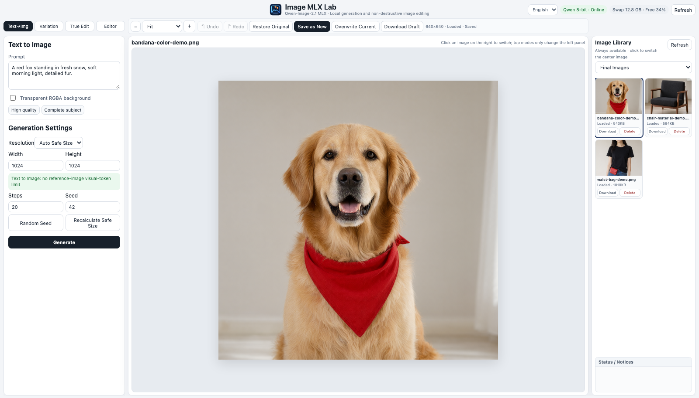
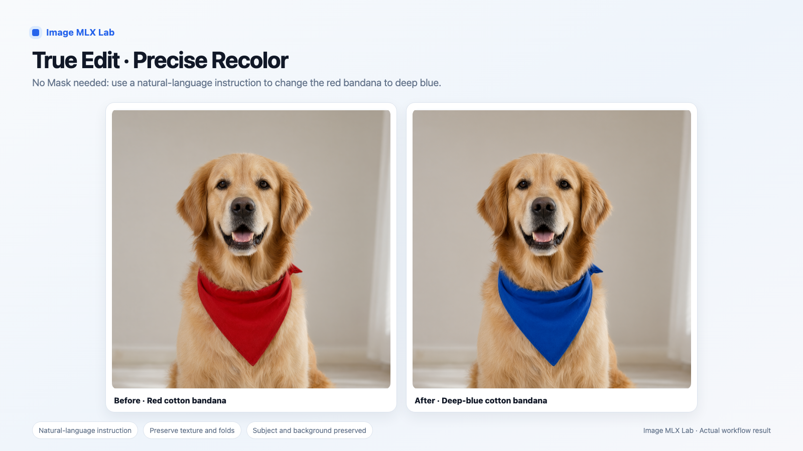
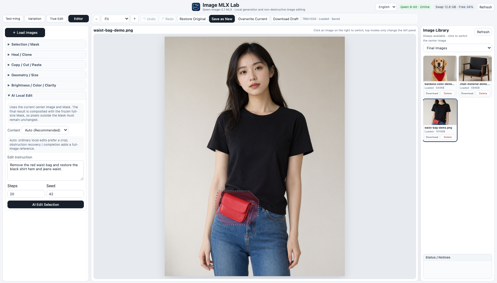
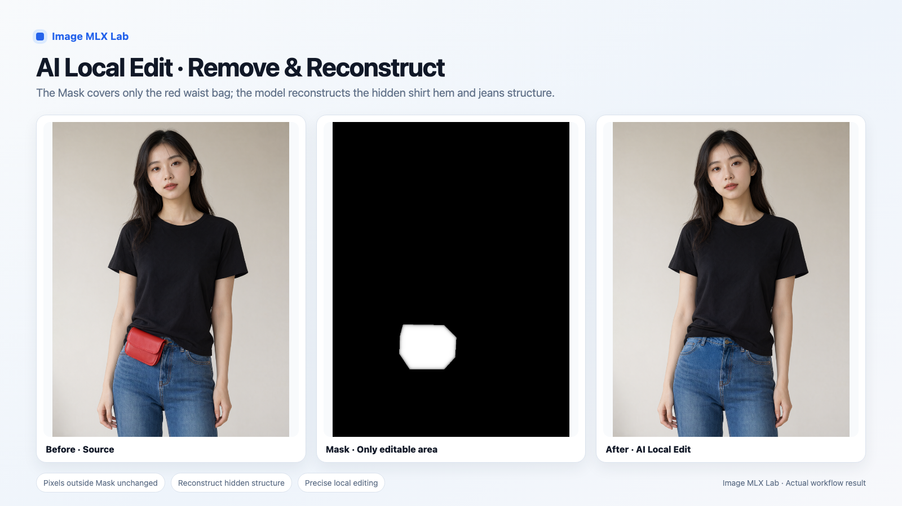
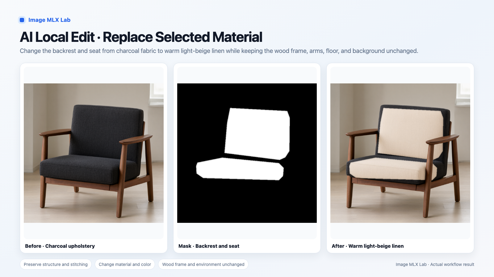

# Image MLX Lab User Guide

**English** | [中文](USER_GUIDE_ZH.md)

> Version: v0.1 · 2026-09-25  
> Applies to the current bilingual web UI.


## 1. What Image MLX Lab is

Image MLX Lab is a local image generation and AI-assisted editing workbench for Apple Silicon Macs.

The current backend uses Qwen-Image-2.1 through an MLX runtime. The web UI and model service listen on localhost, and working images stay under the local `results/` directory.

The workbench has four main modes:

- **Text→Img** — generate a new image from a prompt.
- **Variation** — create a related version from an existing image.
- **True Edit** — explicitly change a specific property or object.
- **Editor** — selections, repair tools, geometry, color adjustments, and AI Local Edit.

The goal is not to reproduce a full Photoshop-style layer system. The focus is a lightweight AI-first workflow where selections and Masks tell the model *where* to work.

---

## 2. Install and start

Recommended baseline: Apple Silicon Mac with 32 GB+ unified memory.

### 2.1 First-time setup

```bash
git clone https://github.com/hera2019/image-mlx-lab.git
cd image-mlx-lab
python3 -m venv .venv
.venv/bin/pip install -r requirements.txt
```

Install the 4-bit model and runtime:

```bash
.venv/bin/python scripts/setup_model.py --model qwen-image-2.1-mlx-4bit
```

For 8-bit:

```bash
.venv/bin/python scripts/setup_model.py --model qwen-image-2.1-mlx-8bit
```

The first model download requires at least **24 GiB of free disk space**. The setup script checks this before downloading.

True Edit and AI Local Edit require the optional edit-vision module (~1.1 GB per model variant). The setup script can download it during installation, or you can add it later.

### 2.2 Daily use

Double-click:

`Start-Image-MLX-Lab.command`

The UI opens at:

`http://127.0.0.1:18080/web/mask-editor/`

Stop it with:

`Stop-Image-MLX-Lab.command`

## 3. Main interface



The interface has three main columns:

1. **Left:** tools for the current mode.
2. **Center:** the current main image.
3. **Right:** image library plus status / notices.

The top row contains:

- mode tabs
- zoom
- undo / redo
- restore original
- Save as New
- Overwrite Current
- Download Draft
- model status
- language selector: 中文 / English

Changing the top mode does **not** replace the current center image.

The right-side image library stays available in every mode. Click any image to make it the current main image.

---

## 4. Choosing the right mode

Choosing the correct mode matters more than endlessly rewriting a prompt.

### 4.1 Text to Image

Use Text→Img when you want a completely new image.

Basic flow:

1. Open **Text→Img**.
2. Enter a prompt.
3. Choose resolution, Steps, and Seed.
4. Click **Generate**.
5. The result is added to the image library and shown in the center.

Transparent RGBA output is available for suitable assets such as stickers, isolated objects, and graphics.

### 4.2 Variation / Image to Image

Variation creates a *related new version* from the source image.

Good for:

- overall style changes
- composition changes
- mood / lighting changes
- creating alternatives from one source

Not ideal for:

- “only change the shirt color”
- “only remove this small object”
- “keep the face identical and change one attribute”

For those tasks, use **True Edit** or **AI Local Edit**.

Strength controls how strongly the result can depart from the source.

### 4.3 True Edit

True Edit is for explicit instructions: change *this* thing while preserving the rest as much as possible.



Typical uses:

- change clothing color
- change an object's color
- change material
- replace a specific object
- keep a subject consistent while changing one property

A useful instruction pattern is:

> The only allowed change: change the red bandana to deep blue. Preserve shape, folds, texture, lighting, subject, pose, and background.

You can include a color name plus a HEX / RGB reference, for example:

`deep blue, close to #2457A6`

Color numbers are semantic guidance for the model, not a promise of exact pixel-level Photoshop color matching.

True Edit supports up to 3 additional reference images.

---

## 5. Image Editor and Masks

The **Editor** mode combines normal image tools with AI Local Edit.

### 5.1 Selection tools

Available selection tools:

- Rectangle
- Ellipse
- Lasso + / Lasso −
- Brush / Erase
- Magic Wand + / Magic Wand −
- Select All / Invert / Clear

A selection is also the Mask used by AI Local Edit.

The visible / white Mask region is the area allowed to change.

### 5.2 Expand, contract, feather

**Expand** grows the selection outward.

Useful when removing an object: expanding by a few pixels can consume leftover edges from the original object.

**Contract** moves the selection inward.

Useful when you want to protect a nearby subject boundary or preserve an original dark piping / outline.

**Feather** creates a soft transition. Start with 0 or a small value for precise edits.

A common lesson: a larger Mask is not always better. If the Mask includes too much unneeded background, the model can regenerate that background and create visible color / texture seams.

---

## 6. AI Local Edit



AI Local Edit is one of the main features of Image MLX Lab.

The workflow is designed so the model does not get the final say over pixels outside the Mask:

1. Freeze the current source image.
2. Freeze the current full-size Mask.
3. Build the appropriate local / full context input.
4. Send the edit request to Qwen.
5. Interpret the returned framing.
6. Place the generated region back into source coordinates.
7. Composite with the frozen full-size Mask.
8. Verify that pixels outside the Mask did not change.

If the outside-Mask safety check finds a change, the result is rejected.



In this example, only the red waist-bag region is editable. Qwen reconstructs the hidden black shirt hem, jeans waist, stitching, and hardware.

### 6.1 Basic AI Local Edit workflow

1. Select or load an image.
2. Enter **Editor**.
3. Build a precise Mask.
4. Expand / contract if needed.
5. Open **AI Local Edit**.
6. Choose Context (Auto is the normal starting point).
7. Enter the edit instruction.
8. Set Steps and Seed.
9. Click **AI Edit Selection**.

The result is saved as a new image automatically. The old image is preserved.

### 6.2 Context modes

**Auto (Recommended)**

The app decides based on the Mask geometry and instruction.

Small, concentrated edits normally use a local crop. Removal / reconstruction instructions can add a full-image reference.

**Local First (Fast)**

Sends a high-resolution local crop + Mask.

Best for:

- recoloring
- local material changes
- small localized edits

**Local + Full Reference**

Sends the high-resolution crop plus a low-resolution full image for identity, pose, background, and occlusion context.

Best for:

- removing an obstruction
- reconstructing hidden clothing or background
- edits that require understanding full-scene structure

**Full Image (Slow)**

Sends the whole source image + full Mask.

Useful when the Mask or crop is already close to the whole image.

### 6.3 Example: local material swap



Only the backrest and seat are selected.

The instruction asks the model to change charcoal upholstery to warm light-beige linen while keeping shape, thickness, stitching, folds, deformation, and shadows.

The wood frame, arms, floor, and background remain outside the editable region.

For this kind of task, **Local First** is usually a good starting point.

---

## 7. Normal editing tools

AI is not required for every edit.

### Clone Stamp

Hold **⌥ Option / Alt + click** to set a source point, then paint on the target area.

Useful for repeating texture and manually cleaning AI boundaries.

### Healing Brush

Best for small spots, dust, and fine scratches.

For large missing areas or structural reconstruction, use Clone Stamp or AI Local Edit.

### Copy / Cut / Paste

Selections can be copied across images. After Paste, adjust:

- position
- width / height
- aspect ratio
- opacity

Paste is only committed after **Apply Paste**.

### Geometry and size

Available operations include:

- rotate left / right 90°
- custom rotation angle
- pixel resize
- lock aspect ratio
- crop to selection bounds

### Brightness / color / clarity

Available adjustments:

- brightness
- contrast
- saturation
- blur
- sharpen

With a selection, adjustments affect only the selected area. Without a selection, they affect the whole image.

The sliders show a live preview. **Apply** commits exactly the previewed adjustment to the draft.

---

## 8. Undo, save, and non-destructive editing

Image MLX Lab tries to preserve source images by default.

### Undo / Redo

Image edits and Mask state are stored together in editor history.

### Save as New

Recommended default.

The draft becomes a new library image while the source remains available.

### Overwrite Current

Only Workbench-managed local images can be overwritten. A confirmation is required.

If unsure, use **Save as New**.

### Unsaved changes

Switching images does not silently discard work.

When the current draft is dirty, the app offers:

- Save as New and Switch
- Overwrite and Switch
- Discard and Switch
- Cancel

Closing or reloading the page also triggers browser protection when there are unsaved edits, pending adjustments, or a floating Paste.

---

## 9. Model settings

Click the model status badge in the top-right corner.

### 4-bit

- ~10 GB model
- lower memory use
- recommended for Macs with 32 GB or less

### 8-bit

- ~17.6 GB
- lower quantization loss
- recommended for 48 GB+ memory

A 32 GB Mac can attempt 8-bit with **Skip memory preflight**, but heavy swap use and severe slowdown are possible.

True Edit / AI Local Edit availability is shown separately for each model variant because each needs its own edit-vision module.

## 10. Resolution, Steps, and Seed

### Resolution

**Auto Safe Size** estimates a size that avoids excessive visual-token load when reference images are involved.

Use **Recalculate Safe Size** after changing references if needed.

### Steps

Higher Steps generally cost more time. They do not guarantee that an incorrect edit instruction will become correct.

A practical workflow:

1. test with moderate Steps
2. confirm that the structure / instruction is working
3. increase Steps only when useful

### Seed

Seed controls generation randomness.

Keep a good Seed when you want to reproduce a promising setup; use **Random Seed** when exploring alternatives.

---

## 11. FAQ

### “I asked to change only a color, but nothing happened.”

Check the mode first.

If you used **Variation**, switch to **True Edit**. Variation is designed to create related versions, not enforce one exact attribute change.

### “Changing the Seed did not fix the problem.”

Seed does not change the fundamental capability of the selected mode.

First decide whether the task belongs to:

- Variation
- True Edit
- AI Local Edit

Then tune Seed.

### “Can HEX / RGB control an exact color?”

You can write values such as:

`#EBE7E3`

or:

`RGB(235, 231, 227)`

But the model treats those values as guidance, not exact pixel constraints. Combine them with a natural-language description.

### “AI Local Edit leaves a thin old edge.”

Adjust the Mask before adding more prompt text.

Try:

- Expand by 2–5 px to consume an old edge.
- Contract by 2–5 px to protect an important border.
- Refine with Lasso or Brush.
- Reduce feathering.
- Use Clone Stamp for a final manual cleanup.

### “Why are there intermediate results?”

The raw Qwen output is not always the final image.

AI Local Edit may still need:

- framing detection
- coordinate remapping
- full-size Mask compositing
- outside-Mask pixel safety verification

Intermediate images are for debugging the model behavior; they are not the same as the final edited library image.

### “Why does the model say Busy?”

Only one model job can run at a time.

This includes Text to Image, Variation, True Edit, AI Local Edit, and model switching. The backend also reports busy state across browser tabs.

### “Why does the badge say Model not installed?”

The Web UI can start before any model is installed.

Click the badge to see the 4-bit / 8-bit installation commands.

---

## 12. Privacy and local data

The default services bind to localhost only:

- Web UI: `127.0.0.1:18080`
- model service: `127.0.0.1:11234`

Working data is stored locally under `results/`, which is excluded from Git:

- `results/web/`
- `results/library/`
- `results/intermediate/`
- `results/performance/`
- `results/settings.json`

Performance logs can include the full prompt used for a generation. They stay local under `results/` unless you explicitly copy or publish them.

Public screenshots in this repository use purpose-generated demo assets rather than private working images.

---

## 13. Responsible use

Follow applicable law and respect privacy, likeness rights, and other legitimate rights.

Do not use this tool to create sexual content involving minors, non-consensual intimate or sexual imagery, fraudulent impersonation, harassment, extortion, or other unlawful content.

You are responsible for compliance with applicable law, platform rules, and model licenses.

---

## 14. Licenses

Image MLX Lab source code uses the MIT License.

The default Qwen-Image-2.1 model uses the Qwen Research License and is restricted to non-commercial research / evaluation unless separate commercial permission is obtained.

Model weights are not included in this repository.

## 15. Quick task guide

| Goal | Recommended mode |
| --- | --- |
| Generate a new image from text | Text→Img |
| Create style / composition alternatives | Variation |
| Change one explicit color / property | True Edit |
| Replace one explicit object while preserving the subject | True Edit |
| Modify only a small selected region | Editor → AI Local Edit |
| Remove an obstruction and reconstruct hidden structure | AI Local Edit → Auto / Local + Full Reference |
| Replace material only inside the selected region | AI Local Edit → Local First |
| Remove dust / small spots | Healing Brush |
| Copy a precise texture | Clone Stamp |
| Brightness / contrast / saturation | Editor |
| Crop / rotate / resize | Editor |

**Choose the mode before rewriting the prompt.**

---

## 16. Three typical workflows

### A. Precise recolor

1. Select the source image.
2. Enter True Edit.
3. State the only allowed change.
4. Add a color name plus HEX / RGB if useful.
5. Generate and compare.

### B. Remove an obstruction and restore hidden content

1. Open the source in Editor.
2. Mask the obstruction with Lasso / Brush.
3. Expand 2–5 px when needed to consume old edges.
4. Open AI Local Edit.
5. Start with Auto context.
6. Ask to remove the obstruction and reconstruct the hidden original structure.
7. Inspect boundaries.
8. Refine the Mask or use Clone Stamp for small cleanup.

### C. Local material replacement

1. Precisely select the material region.
2. Contract slightly if you need to protect a border.
3. Use AI Local Edit.
4. Start with Local First.
5. Describe the new material while asking to preserve shape, thickness, seams, folds, and shadows.
6. Compare Before / After.

---

## 17. Note for contributors

The bilingual UI intentionally separates **display text** from **model prompt text**.

Do not translate these tested internal Chinese prompt components merely because the UI is English:

- AI Local Edit prompt wrappers
- reference-image role prefix
- transparent-background sentence
- Chinese semantic terms used by the automatic context detector

This separation prevents UI localization from silently changing model behavior.
