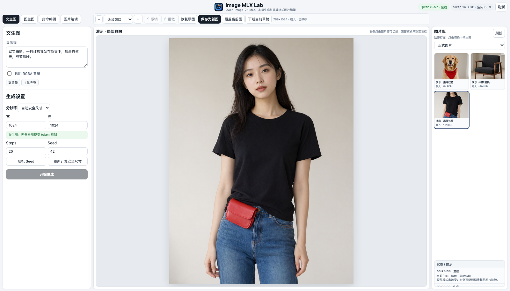
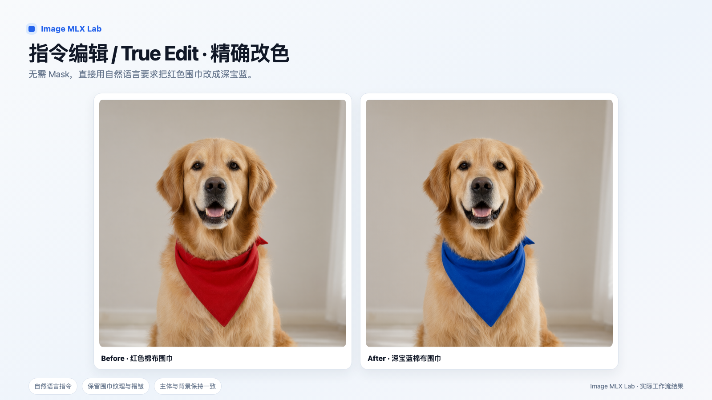
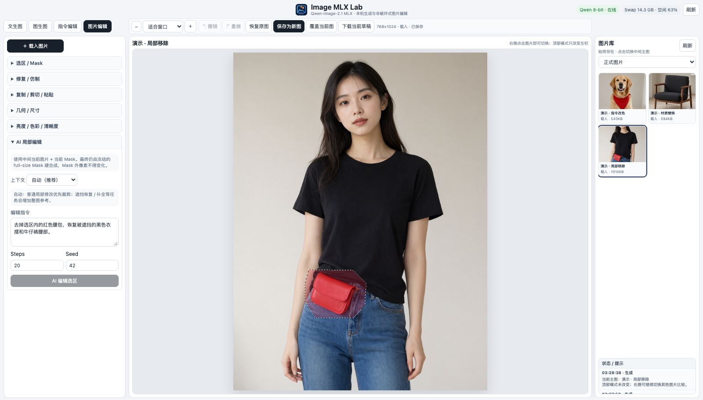
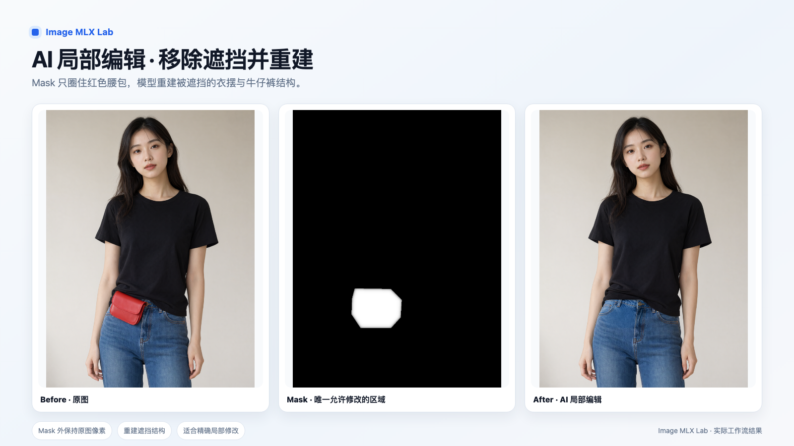
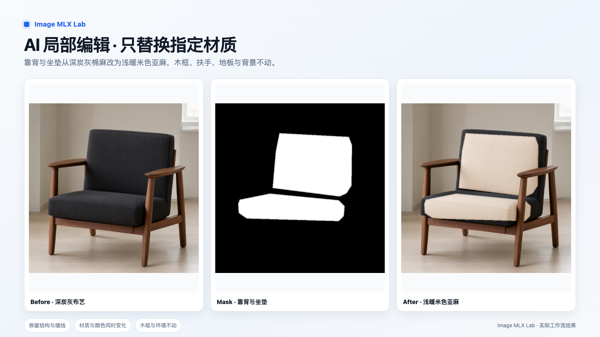

# Image MLX Lab 使用说明（中文）

[English](USER_GUIDE_EN.md) | **中文**

> 版本：v0.1 · 2026-09-25  
> 适用界面：当前中文界面


## 1. Image MLX Lab 是什么

Image MLX Lab 是一个面向 Apple Silicon Mac 的本地图像生成与编辑工作台。

当前后端使用 Qwen-Image-2.1 MLX。图片、提示词和生成结果都在本机处理，网页界面只监听本机 `127.0.0.1`，默认不会把图片上传到外部服务器。

它同时提供四类工作方式：

- **文生图**：根据文字生成全新图片。
- **图生图**：根据当前图片生成相似变体，适合整体风格、构图和氛围变化。
- **指令编辑**：用自然语言明确修改当前图片中的指定内容。
- **图片编辑**：普通选区、修复、调色、裁剪、复制粘贴，以及 AI 局部编辑。

Image MLX Lab 的重点不是替代 Photoshop，而是把“选区 + AI 编辑 + 本地生成”组合成一个轻量工作流。

---
## 2. 安装与第一次启动

### 2.1 基本要求

建议使用 Apple Silicon Mac（M1 及以后）。

- 4-bit 模型约占 10 GB 磁盘空间。
- 8-bit 模型约占 17.6 GB。
- 指令编辑 / AI 局部编辑还需要额外的视觉模块，约 1.1 GB。
- **首次下载模型前，安装脚本要求至少 24 GiB 可用磁盘空间**，避免大文件下载到一半因空间不足失败；安装完成后的实际占用会低于这个预留值。
- 32 GB 内存可以使用 4-bit；8-bit 在 32 GB 机器上通常需要跳过内存预检，并可能大量使用 swap。

首次安装项目后，在项目目录建立 Python 环境并安装依赖：

```bash
python3 -m venv .venv
.venv/bin/pip install -r requirements.txt
```

下载 4-bit 模型：

```bash
.venv/bin/python scripts/setup_model.py --model qwen-image-2.1-mlx-4bit
```

如果希望使用 8-bit，把模型名改为 `qwen-image-2.1-mlx-8bit`。

### 2.2 启动与停止

安装完成后，日常使用不需要输入命令。

双击：

`Start-Image-MLX-Lab.command`

浏览器会自动打开：

`http://127.0.0.1:18080/web/mask-editor/`

页面右上角会显示模型状态。模型第一次加载通常需要一段时间，显示“在线”后即可生成。

停止程序时双击：

`Stop-Image-MLX-Lab.command`

> 建议正常停止，不要直接长期留下模型进程占用内存。

---

## 3. 认识主界面



界面由三列组成：

1. **左栏：当前模式的工具**
2. **中间：当前主图**
3. **右栏：图片库与状态提示**

顶部四个模式按钮只改变左栏内容，中间主图和右侧图片库始终保留。

### 3.1 顶部工具栏

顶部模式：

- 文生图
- 图生图
- 指令编辑
- 图片编辑

中间主图上方还有：

- 缩放：适合窗口、25%、50%、100%、200%、400%
- 撤销 / 重做
- 恢复原图
- 保存为新图
- 覆盖当前图
- 下载当前草稿

默认建议使用 **保存为新图**。这样原图始终保留，适合反复比较不同结果。

### 3.2 右侧图片库

右侧图片库用于保存和切换当前工作图片。

点击任意图片，只会切换中间主图，不会改变当前顶部模式。

可筛选：

- 正式图片
- 全部
- 生成
- 载入
- 编辑保存
- 中间结果

底部“状态 / 提示”保留最近的运行消息，最新一条显示在最上面。

---
## 4. 四种模式怎么选

### 4.1 文生图

适合从零开始生成一张新图片。

基本步骤：

1. 点击顶部 **文生图**。
2. 输入提示词。
3. 选择分辨率、Steps、Seed。
4. 点击 **开始生成**。
5. 新图会自动进入右侧图片库，并成为中间主图。

可选“透明 RGBA 背景”。透明背景适合图标、贴纸、素材等用途。

提示词不需要特别复杂。先描述主体、环境、光线、风格，再根据结果逐步调整通常更有效。

---

### 4.2 图生图

**图生图的目标是生成“相似的新版本”，不是精确修改指定属性。**

适合：

- 改整体风格
- 改构图
- 改画面氛围
- 从同一原图获得不同版本

不适合：

- 只把黑衣服改成灰色
- 只替换某个小物体
- 要求人物面貌完全不动

使用步骤：

1. 先在右侧图片库选择主图，或在左栏载入图片。
2. 点击顶部 **图生图**。
3. 输入希望得到的新版本描述。
4. 调整 Strength。
5. 点击生成。

Strength 越高，结果越可能偏离原图；越低，越倾向保留原图。

> 如果你的要求是“只改一个明确属性，其他全部保持”，请改用 **指令编辑**。

---

### 4.3 指令编辑

指令编辑（True Edit）用于明确告诉模型“改什么”。

适合：

- 改衣服颜色
- 改物体颜色
- 替换指定对象
- 调整某个材质
- 保持主体一致，只修改某个细节



上图中，我们只要求把金毛犬的红色棉布围巾改为深宝蓝。

犬只的脸、毛发、姿势、构图和背景保持一致。这类任务使用指令编辑通常比图生图更合适。

基本步骤：

1. 在右侧选择一张图片作为主图。
2. 点击顶部 **指令编辑**。
3. 输入明确的编辑要求。
4. 如有需要，可加入额外参考图。
5. 设置 Steps、Seed 和安全尺寸。
6. 点击生成。

建议把最重要的修改要求放在提示词前面，例如：

> 唯一允许的修改：把红色围巾改成深宝蓝色。保持围巾形状、纹理、褶皱和阴影不变，其他所有内容保持原样。

颜色可以同时写自然语言和色值，例如：

`深宝蓝色，接近 #2457A6`

> HEX / RGB 数值只能作为模型参考，不等于 Photoshop 的精确像素取色。

---
## 5. 图片编辑

图片编辑模式提供普通编辑工具和 AI 局部编辑。

点击顶部 **图片编辑** 后，左栏会显示一组可折叠工具。

### 5.1 选区 / Mask

可使用：

- 矩形
- 椭圆
- 自由套索加选 / 减选
- 画笔加选 / 擦除
- 魔棒加选 / 减选
- 全选 / 反选 / 清除选区

Mask 既是普通选区，也是 AI 局部编辑的控制区域。

白色 / 可见选区代表允许修改的区域，选区外是保护区域。

### 5.2 扩展、收缩与羽化

**扩展**：把选区向外扩大指定像素。

适合去除遮挡物时多吃掉几像素残边。

**收缩**：把选区向内缩小。

适合保护主体边缘，避免 AI 修改碰到不该动的部分。

**边缘羽化**：让选区边缘平滑过渡。

对于需要精确保持边界的任务，建议从 0 或较小羽化开始。

---

## 6. AI 局部编辑



这是 Image MLX Lab 的重点功能之一。

它的工作方式不是“让模型重新生成整张图”，而是：

1. 冻结当前原图。
2. 冻结当前 Mask。
3. 只把需要的区域送给模型。
4. 得到 AI 编辑结果。
5. 最终再次用原始 full-size Mask 硬合成。
6. Mask 外像素必须保持原图不变。



上图只选择红色腰包区域。AI 去掉腰包后，重新补出被遮挡的黑色衣摆、牛仔裤腰头、扣件和车线。

最终结果只应用到 Mask 内，人物脸、身体、手臂和背景继续使用原图像素。

### 6.1 AI 局部编辑步骤

1. 选择或载入一张图片。
2. 点击顶部 **图片编辑**。
3. 使用矩形、套索、画笔或魔棒建立 Mask。
4. 必要时使用 **扩展 / 收缩** 调整边界。
5. 展开 **AI 局部编辑**。
6. 选择上下文模式。
7. 输入编辑指令。
8. 设置 Steps 与 Seed。
9. 点击 **AI 编辑选区**。

完成后：

- 新结果自动保存为新图。
- 右侧图片库会出现新图片。
- 原图保留。
- 旧 Mask 清空。
- 新图开始一套新的撤销历史。

### 6.2 四种上下文模式

**自动（推荐）**

让程序根据 Mask 范围和提示词自动判断。

普通小范围编辑通常优先使用局部模式；去遮挡、补全、恢复结构等任务会倾向加入整图参考。

**局部优先（快）**

只把 Mask 周围的高分辨率局部区域和 Mask 送给模型。

优点：

- 快
- 局部细节多
- 不容易被整图构图干扰

适合：

- 改颜色
- 改局部材质
- 小范围内容调整

**局部 + 整图参考**

高分辨率局部负责编辑，同时给模型一张低分辨率整图作为结构参考。

适合：

- 去除遮挡物
- 恢复被挡住的衣服 / 身体 / 背景
- 需要理解主体姿态或上下文关系的任务

**整图（慢）**

完整原图 + 完整 Mask 一起送给模型。

适合 Mask 范围很大或局部裁剪已经接近整张图的情况。

---
### 6.3 示例：只替换指定材质



这组示例只选择靠背和坐垫。

编辑要求是：

> 把深炭灰色棉麻坐垫和靠背改成浅暖米色天然亚麻，保持原有轮廓、厚度、缝线、包边、褶皱、受力形变和阴影不变。

最终结果：

- 靠背 / 坐垫发生变化
- 木框、扶手和椅腿不变
- 地板和背景不变
- 原有深色包边保留

这类任务适合使用 **局部优先**。

### 6.4 Mask 的经验

Mask 不一定越大越好。

如果 Mask 把大量本来不需要修改的区域一起圈进去，模型可能重新生成那些区域，造成颜色或纹理接缝。

通常更好的做法是：

- 尽量贴着真正需要修改的对象
- 去遮挡时略微扩展几像素，吃掉残边
- 改材质时可适当收缩，保护边界
- 先看一次结果，再微调 Mask，而不是无限增加提示词

---

## 7. 普通编辑工具

AI 不是所有任务都需要用。

### 7.1 修复 / 仿制

**克隆图章**

使用 Option / Alt + 点击设置取样点，然后在目标区域涂抹。

适合：

- 重复纹理
- 小范围复制
- 手动修补 AI 边缘

**修复画笔**

适合：

- 小污点
- 灰尘
- 细划痕

复杂纹理、大面积缺失或结构恢复，优先使用克隆图章或 AI 局部编辑。

### 7.2 复制 / 剪切 / 粘贴

选区内容可以 Copy / Cut / Paste，并且可以跨图片使用。

粘贴后可以调整：

- 宽度
- 高度
- 是否保持比例
- 透明度
- 位置

点击“确定粘贴”后才正式写入图片。

### 7.3 几何 / 尺寸

提供：

- 左 / 右旋转 90°
- 自定义旋转角度
- 修改实际像素尺寸
- 保持比例缩放
- 裁剪到选区外框

### 7.4 亮度 / 色彩 / 清晰度

提供：

- 亮度
- 对比度
- 饱和度
- 模糊
- 锐化

如果当前存在选区，这些调整只作用于选区。

没有选区时，作用于整张图片。

修改先作为预览存在，确认后点击 **应用**。

---

## 8. 撤销、保存与非破坏式工作流

Image MLX Lab 默认尽量避免破坏原图。

### 8.1 撤销 / 重做

图片编辑中的像素修改和 Mask 会一起记录。

撤销后再重做，应恢复相同的图片与 Mask 状态。

### 8.2 保存为新图

推荐使用。

当前草稿会保存为新的图片，原图继续保留。

适合：

- 比较多个版本
- AI 局部编辑
- 不确定最终效果时

### 8.3 覆盖当前图

只有 Workbench 管理的图片可以被覆盖。

覆盖前会要求明确确认。

如果不确定，请使用“保存为新图”。

### 8.4 下载当前草稿

把当前正在编辑的画面直接下载到本机。

适合：

- 临时导出
- 还没决定是否加入图片库
- 需要拿到其他软件继续处理

### 8.5 切换图片时有未保存修改

程序不会静默丢弃修改。

会提供：

- 保存为新图并切换
- 覆盖当前图并切换
- 丢弃修改并切换
- 取消

关闭 / 刷新页面时如果存在未保存修改，也会触发浏览器离开页面确认。

---
## 9. 模型设置：4-bit / 8-bit

点击页面右上角的模型状态按钮，可以打开模型设置。

### 9.1 4-bit

特点：

- 模型约 10 GB
- 内存占用较低
- 更适合 32 GB 及以下内存的 Mac

### 9.2 8-bit

特点：

- 模型约 17.6 GB
- 量化损失更小
- 推荐 48 GB 以上内存

32 GB 机器也可以尝试，但通常需要启用“跳过内存预检”，并可能产生大量 swap，速度明显变慢。

### 9.3 跳过内存预检

这是高级选项。

正常情况下，mlx-serve 会在可用内存不足时拒绝加载。

勾选后可以强制尝试，但可能：

- 大量使用 swap
- 系统明显变慢
- 应用响应时间变长
- 极端情况下系统接近无响应

如果机器内存足够，不建议开启。

### 9.4 指令编辑为什么有时不可用

指令编辑和 AI 局部编辑需要额外的编辑视觉模块：

`qwen21_visual.safetensors`

它约 1.1 GB，每个模型版本分别安装。

如果当前 4-bit 或 8-bit 没有对应视觉模块，界面会提示补装。

### 9.5 切换模型

切换 4-bit / 8-bit 时：

1. 当前模型停止。
2. 新模型启动并加载。
3. 右上角状态显示“切换中 / 加载中”。
4. 模型在线后恢复生成按钮。

加载期间不能再次切换，也不能启动新的生成任务。

---

## 10. 生成设置

### 10.1 分辨率

可选择预设尺寸，也可自定义。

“自动安全尺寸”会根据当前模式和参考图数量尽量避免视觉 token 过高。

如果尺寸过大，建议先让程序重新计算安全尺寸。

### 10.2 Steps

Steps 越高，通常计算时间越长。

并不是所有任务都需要很高 Steps。

建议：

- 快速测试：较低 Steps
- 确认提示词有效后：再提高 Steps
- 局部编辑：先用中等 Steps 看结构是否正确

### 10.3 Seed

Seed（随机种子）控制生成随机性。

相同模型、相同输入、相同参数和相同 Seed，通常更容易得到接近的结果。

想尝试新结果时：

- 点击“随机 Seed”
- 或手动输入新的整数

如果某次结果很好，建议记录 Seed。

---

## 11. 常见问题

### 11.1 为什么我写“只改衣服颜色”，结果完全没改？

先确认你使用的是 **指令编辑**，不是图生图。

图生图的目标是生成相似变体，它可能更重视保留原图视觉特征，因此不一定执行精确属性修改。

### 11.2 为什么换 Seed 也不解决？

如果选错模式，换 Seed 只是重复运行同一种能力。

先确认任务应该使用：

- 图生图
- 指令编辑
- AI 局部编辑

再调整 Seed。

### 11.3 HEX / RGB 能不能精确控制颜色？

可以写：

`#EBE7E3`

或：

`RGB(235, 231, 227)`

但图像模型不是 Photoshop。

数字色值是语义参考，不能保证最终每个像素严格等于指定 RGB。

建议同时写自然语言：

> 非常浅的暖灰色，接近 #EBE7E3 / RGB(235, 231, 227)

### 11.4 AI 局部编辑边缘有残留怎么办？

优先调整 Mask，而不是继续增加提示词。

可以尝试：

- 扩展 2–5 px：吃掉旧物体残边
- 收缩 2–5 px：避免碰到主体边缘
- 改用套索或画笔精细修 Mask
- 减小羽化
- 必要时用克隆图章做最后修补

### 11.5 为什么右侧有“中间结果”？

模型原始输出不一定等于最终图片。

特别是 AI 局部编辑，最终图片还要经过：

- 构图判断
- crop 放回原位置
- frozen Mask 硬合成
- Mask 外像素安全检查

因此中间结果只用于调试和查看模型行为，不应与最终正式图片混淆。
### 11.6 为什么模型显示“忙”？

Image MLX Lab 同一时间只运行一个模型任务。

包括：

- 文生图
- 图生图
- 指令编辑
- AI 局部编辑
- 模型切换

如果另一个浏览器标签页正在生成，本页也会读取后端 busy 状态并暂时禁用运行按钮。

### 11.7 页面显示模型“加载中”

等待右上角状态变为“在线”。

模型加载期间不要反复点击启动或切换。

如果长时间失败，可查看：

`~/.mlx-serve/logs/image-mlx-lab-model.log`

---

## 12. 隐私与本地数据

Image MLX Lab 默认只在本机运行。

Web UI：`127.0.0.1:18080`

模型服务：`127.0.0.1:11234`

默认不开放到局域网或互联网。

所有工作图片都保存在本地 `results/` 下，并被 Git 忽略。

主要目录：

- `results/web/`：正式生成 / 编辑图片
- `results/library/`：载入的图片
- `results/intermediate/`：模型中间结果
- `results/performance/`：性能记录
- `results/settings.json`：模型设置

不要把私人图片从 `results/` 直接复制到公开仓库。

公开截图 / 演示图应该使用专门生成的演示素材，并经过人工检查后再进入 `docs/images/`。

### 12.1 使用规范

请遵守当地法律，并尊重他人的隐私、肖像权和其他合法权益。

不得将本工具用于制作涉及未成年人的色情内容、未经本人同意的私密或色情影像、欺诈性冒充、骚扰、勒索或其他违法用途。

使用者应自行确认其使用方式及生成 / 编辑内容符合适用法律、平台规则和模型许可证。

---

## 13. 许可证

Image MLX Lab 源代码采用 MIT License。

默认使用的 Qwen-Image-2.1 模型采用 Qwen Research License。

当前默认模型许可证限制模型用于非商业研究 / 评估；商业使用模型需要另行取得相应许可。

模型权重不包含在 Image MLX Lab 仓库中，由用户自行下载。

代码许可证和模型许可证是两件不同的事情。

---

## 14. 任务速查

| 你想做什么 | 推荐模式 |
|---|---|
| 从文字生成全新图片 | 文生图 |
| 根据原图做不同风格 / 构图版本 | 图生图 |
| 只把衣服颜色改掉 | 指令编辑 |
| 保持人物一致，替换一个明确对象 | 指令编辑 |
| 只修改图片的一小块 | 图片编辑 → AI 局部编辑 |
| 去掉遮挡物并补回后面结构 | AI 局部编辑，自动 / 局部 + 整图参考 |
| 只替换选中区域的材质 | AI 局部编辑，局部优先 |
| 去灰尘 / 小污点 | 修复画笔 |
| 精确复制纹理 | 克隆图章 |
| 调整亮度 / 对比度 / 饱和度 | 图片编辑 |
| 裁剪 / 旋转 / 改尺寸 | 图片编辑 |

### 推荐原则

**先选对模式，再写提示词。**

很多“提示词完全不起作用”的问题，本质上不是文字写得不好，而是把“精确编辑”交给了“相似变体”。

---

## 15. 三个典型工作流

### A. 精确改颜色

1. 选择原图。
2. 进入 **指令编辑**。
3. 写明“唯一允许修改的内容”。
4. 写目标颜色名称 + HEX / RGB 参考。
5. 生成并比较结果。

### B. 去除遮挡物并恢复后面内容

1. 选择原图。
2. 进入 **图片编辑**。
3. 用套索 / 画笔把遮挡物圈成 Mask。
4. 视情况扩展 2–5 px。
5. 打开 **AI 局部编辑**。
6. 上下文选择“自动”。
7. 写“去掉遮挡物，恢复被遮挡的原始结构”。
8. 运行后检查边缘。
9. 如有少量残边，调整 Mask 重试或用克隆图章修补。

### C. 局部换材质

1. 精确选择需要换材质的区域。
2. 适当收缩 Mask，保护边界。
3. 进入 AI 局部编辑。
4. 选择“局部优先”。
5. 描述新材质，同时要求保持轮廓、厚度、缝线、褶皱和阴影。
6. 生成后用 Before / After 比较。

---

## 16. 关于本说明书

本说明书随当前公开版本持续维护。

后续计划：

- 已包含主界面与 AI 局部编辑实际操作截图，后续继续补充更多步骤图
- 补充更完整的安装故障排查
- 根据用户反馈调整章节
- 中文版稳定后制作英文版
- 英文版只翻译用户界面和说明文字，不修改模型内部使用的中文提示词

